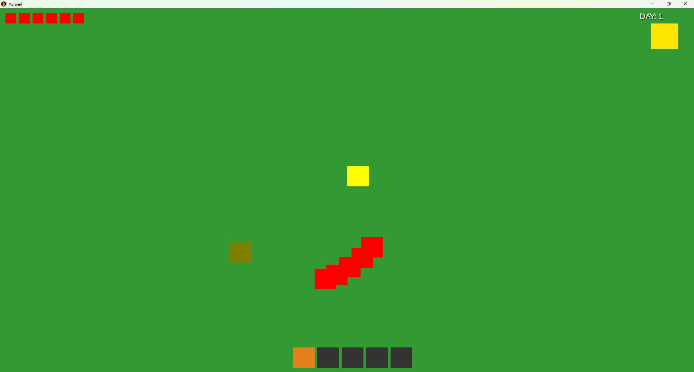

# Ashveil

2D top-down survival game built with Java and LibGDX.

## About

Ashveil is a 2D top-down survival game built in Java using LibGDX.

The project focuses on building solid gameplay systems first (movement, combat, world logic), while the visual side (pixel art, atmosphere, assets) will be developed alongside and improved over time.

## Current State

The game is still in early development.

Core systems are already implemented, while visuals are currently simple placeholders used for testing and iteration. Custom pixel art and proper visuals are planned as the project evolves.

## Features

* tile-based world
* player movement with collision
* simple enemy AI (zombies)
* melee combat (direction-based)
* item pickup system
* day/night cycle
* basic HUD (health + day counter)

## Structure

The project is organized around a central `World` class that handles game state and updates.

Rendering is separated into a `WorldRenderer`, so game logic and drawing are not mixed.

Player input is handled outside of the entity itself, keeping entities focused on behavior rather than controls.

## Controls

* WASD — movement
* K — attack
* E — interact / pick up

## Screenshot

## Notes

This project is mainly used to practice:

* game architecture
* system separation
* real-time update loops

More features and proper visuals are planned.
