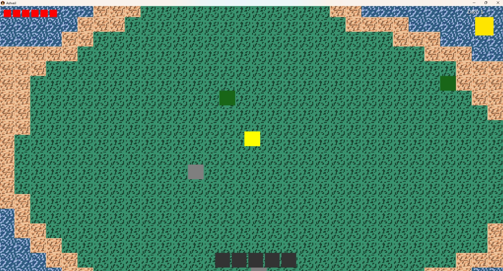
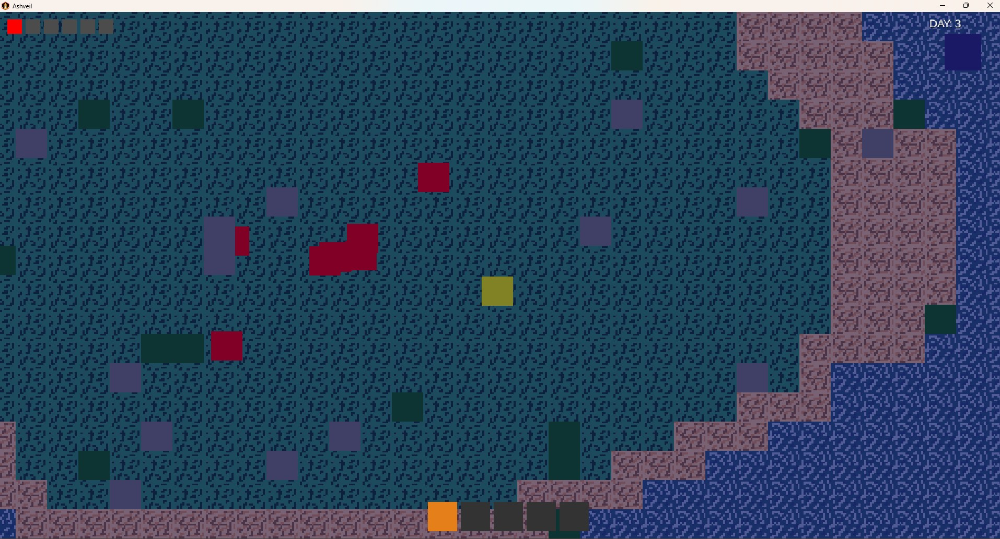

# Ashveil

Ashveil is a 2D top-down survival game developed in Java using LibGDX.

The project focuses on building gameplay systems and a clean object-oriented architecture. Most visuals are currently placeholders and will be replaced with custom pixel art, animations, audio, and visual effects as development continues.

## Current Features

- Tiled map rendering and collision
- Player movement and camera tracking
- Enemy movement and melee combat
- Resource harvesting
- Procedural resource and enemy spawning
- Item pickup and dropping
- Inventory and five-slot hotbar
- Basic crafting
- Day and night cycle
- Responsive HUD
- Basic death and game-over flow

## Architecture

Gameplay logic, rendering, input, UI, and map data are separated into dedicated classes and packages.

- `World` manages the current game state and gameplay updates.
- `TileMap` loads the Tiled map and provides collision data.
- `WorldRenderer` renders the world and entities.
- `HudRenderer` renders the user interface.
- `CameraController` follows the player within map boundaries.
- `PlayerInput` and `KeyBindings` keep controls separate from entity logic.

## Controls

| Control | Action |
|---|---|
| `W`, `A`, `S`, `D` | Move |
| `K` | Attack / harvest |
| `E` | Interact / pick up |
| `F` | Use item |
| `Q` | Drop one item |
| `Left Ctrl + Q` | Drop the full stack |
| `Left Shift` | Dash |
| `1–5` | Select hotbar slot |
| `Tab` | Open or close the crafting overlay |

## Planned Features

- Improved combat and enemy behavior
- Tools and durability
- Farming and building
- Save and load system
- Multiple islands and map transitions
- Settings and control rebinding
- Tutorial and progression systems
- Custom pixel art, animations, and audio

## Gameplay

  
  

